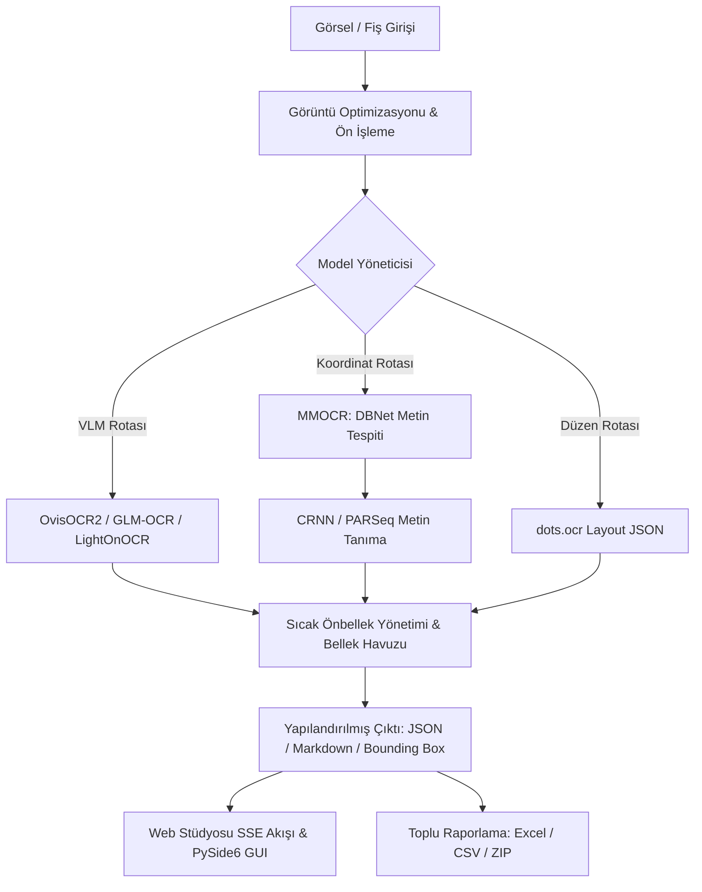

# ⚡ VisionOCR Studio

> **Çok Modelli Görsel Dil Ağları (VLM / ViT) ve Derin Öğrenme Tabanlı, Sıcak Önbellek Mimarili Yerel Fiş ve Belge Ayrıştırma Platformu**  
> *TÜBİTAK 2209-B & Üniversite Bitirme Projesi*

[](https://www.python.org/)
[](https://fastapi.tiangolo.com/)
[](https://www.qt.io/)
[-EE4C2C.svg?logo=pytorch&logoColor=white)](https://pytorch.org/)
[](LICENSE)

---

## 📖 Genel Bakış

**VisionOCR Studio**, perakende, muhasebe ve kurumsal masraf süreçlerinde fiziksel fiş, fatura ve ticari belgelerin sayısallaştırılmasını sağlayan yüksek performanslı bir yapay zekâ platformudur.

Geleneksel OCR yaklaşımları (Tesseract vb.) termal kağıt silintileri ve karmaşık tablolarda yetersiz kalırken; bulut tabanlı ticari API'ler (AWS Textract, Google Vision) yüksek işlem maliyetleri ve KVKK/GDPR veri gizliliği riskleri doğurmaktadır.

VisionOCR Studio; **son teknoloji açık kaynaklı Görsel Dil Modellerini (VLM)** ve derin öğrenme boru hatlarını **tamamen yerel donanımda (Apple Silicon MPS / CUDA)** çalıştırarak sıfır API maliyeti, sıfır veri sızıntısı ve **1 saniyenin altında (<1.0s)** çıkarım hızı sunar.

---

## ✨ Öne Çıkan Yetenekler

- 🚀 **Sıcak Önbellek Mimarisi (Warm Cache):** Modelleri bellekte hazır tutarak her çıkarımda modeli yeniden yükleme (cold start) maliyetini ortadan kaldırır.
- ⚡ **Apple Silicon (MPS) & CUDA Donanım Hızlandırma:** FP16 / Float16 optimizasyonu ile Mac ve PC üzerinde yüksek hızlı çıkarım.
- 📝 **Canlı SSE Daktilo Akışı (Server-Sent Events):** VLM çıkarımını anlık token akışı olarak tarayıcıya yansıtır.
- 📦 **Endüstriyel Toplu İşleme (Batch Engine):** Yüzlerce fiş ve faturayı sürükle-bırak yöntemiyle sıraya alıp işler; sonuçları tek tıkla Excel, CSV ve JSON olarak dışa aktarır.
- 🖥️ **Çift Arayüz Desteği:**
  - **Modern Web Arayüzü:** FastAPI + SSE destekli hafif ve modern web stüdyosu.
  - **Masaüstü Uygulaması:** PySide6 / Qt6 tabanlı yerel masaüstü arayüzü.
- 🛠️ **Akıllı Görüntü Ön İşleme:** Fiş ve belgeler için otomatik kontrast dengeleme, gürültü temizleme ve en-boy oranına göre akıllı ölçekleme.

---

## 🧠 Desteklenen Model Ailesi

| Model | Mimari Türü | Parametre | Optimize Cihaz | Ortalama Süre (Sıcak) | Öne Çıkan Kullanım Alanı |
| :--- | :--- | :--- | :--- | :--- | :--- |
| **OvisOCR2** | Qwen3.5 VLM | 0.9B | MPS / CUDA | **~0.65s** | Fişler, faturalar, temiz Markdown & Tablo çıkarımı |
| **GLM-OCR** | ViT Doküman VLM | 0.9B | MPS / CUDA | **~0.55s** | Termal fiş metinleri, bozuk dokümanlar |
| **LightOnOCR-2-1B** | Mistral VLM | 2.1B | MPS / CUDA | **~0.74s** | Yoğun metinli raporlar, karmaşık tablolar |
| **MMOCR** | DBNet (ResNet-50) + CRNN | Hibrit | MPS / CPU | **~1.10s** | Piksel koordinatlı (Bounding Box) satır tespiti |
| **dots.ocr** | Qwen Layout VLM | 2.9B | MPS / CUDA | **~1.20s** | Hiyerarşik sayfa düzeni (JSON Layout) ayrıştırma |
| **CRNN** | CNN + BiLSTM + CTC | Hafif | CPU / MPS | **~0.08s** | Ultra hızlı tek satır metin okuma |

---

## 🏗️ Sistem Mimarisi



---

## 🚀 Hızlı Başlangıç

### 1. Gereksinimler
- Python 3.10 veya üzeri
- macOS (Apple Silicon M1/M2/M3/M4 tavsiye edilir) veya Linux / Windows (CUDA destekli)

### 2. Kurulum

Depoyu klonlayın ve sanal ortam oluşturun:
```bash
git clone https://github.com/gedik25/VisionOCR.git
cd VisionOCR

python3 -m venv venv
source venv/bin/activate   # Windows için: venv\Scripts\activate
```

Bağımlılıkları yükleyin:
```bash
pip install --upgrade pip
pip install torch torchvision torchaudio
pip install transformers accelerate fastapi uvicorn PySide6 Pillow
```

### 3. Çalıştırma

#### 🌐 Web Arayüzünü Başlatma (Önerilen)
```bash
python run_web.py
```
Tarayıcınızdan açın: **`http://127.0.0.1:8080`**

#### 🖥️ Masaüstü (Qt6 / PySide6) Arayüzünü Başlatma
```bash
python main.py
```

#### 💻 Komut Satırından (CLI) Tekil veya Toplu Çıkarım
```bash
# Tekil görsel testi (OvisOCR2 ile):
python ocr_runner.py --model OvisOCR2 --image ocr/GLM-OCR/sample_test.png

# Bir klasördeki tüm fişleri topluca işleme:
python batch_runner.py --input belgeler/ --output sonuclar/ --model OvisOCR2
```

---

## 🧪 Testler

Proje bünyesinde tüm modelleri, bellek yönetimini, streaming akışını ve web uç noktalarını kapsayan **60 adet birim ve entegrasyon testi** bulunmaktadır:

```bash
python -m unittest discover -s unit_tests
```
Çıktı: `Ran 60 tests in 78.774s — OK`

---

## 📂 Proje Dizin Yapısı

```
bitirme-projesi/
├── ocr/                     # OCR & VLM modelleri çıkarım motorları
│   ├── model_manager.py     # Sıcak önbellek, model yaşam döngüsü ve SSE akışı
│   ├── image_optimizer.py   # Akıllı boyutlandırma ve görüntü iyileştirme
│   ├── batch_pipeline.py    # Çoklu iş parçacıklı toplu işleme boru hattı
│   ├── OvisOCR2/            # OvisOCR2 çıkarım modülü
│   ├── GLM-OCR/             # GLM-OCR çıkarım modülü
│   ├── LightOnOCR-2-1B/     # LightOnOCR çıkarım modülü
│   ├── MMOCR/               # OpenMMLab DBNet + CRNN çıkarım modülü
│   └── dots-ocr/            # dots.ocr sayfa düzeni ayrıştırma modülü
├── web/                     # FastAPI web sunucusu ve statik arayüz
│   ├── server.py            # REST API ve SSE streaming uç noktaları
│   └── static/              # Modern web stüdyosu (HTML, CSS, JS)
├── gui/                     # PySide6 (Qt6) masaüstü arayüz bileşenleri
├── unit_tests/              # 60 adet kapsamlı birim ve entegrasyon testi
├── run_web.py               # Web sunucusu başlatıcı
├── main.py                  # Masaüstü uygulaması başlatıcı
└── batch_runner.py          # CLI toplu işleme aracı
```

---

## 📄 Lisans

Bu proje akademik araştırma ve geliştirme amacıyla hazırlanmıştır. [MIT Lisansı](LICENSE) kapsamında sunulmaktadır.
